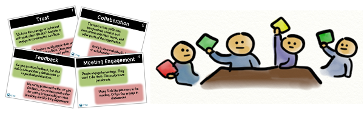

<h1 align="center">
    
</h1>

<h4 align="center"> 
	🚧 TeamBarometer 1.0 🚀 under construction... 🚧
</h4>

## 💻 About the project

⏲ Team Barometer - is a self-evaluation tool created by Jimmy Janlén so that a team can measure if they get tighter and better as a team over time, it is executed as a survey in a workshop and it consists of some team characteristics, packaged as a deck of cards. Team members vote green, yellow or red for each card in the meeting. Once all cards have been run through, the team reflects and discusses the results.

This project is a software to run this meeting and help to evaluate and improve the main characteristics of a team, the idea is to use this project to experiment practices, architectures and technologies, but I believe so many teams can take advantage using this tool.

For more detailed information about this meeting you can read these articles:

- https://blog.crisp.se/2014/01/30/jimmyjanlen/team-barometer-self-evaluation-tool
- https://code.likeagirl.io/usando-o-team-barometer-para-entender-como-est%C3%A1-o-seu-time-e642aa00933e

## 🛠 Technologies

The following tools were used to construct and build the project:

- [ASP.NET Core][aspnet]
- [React][reactjs]
- [Docker][docker]

## 🚀 How to execute the project

This project can be executed in two ways:
1. Docker
2. Cloning the repository and running the applications

### 🐳 Docker

### Prerequisites

- [Git](https://git-scm.com)
- [Docker][docker]

The project is divided in two applications, a client web developed in React and a server developed in ASP.NET Core, both applications are dockerized, which means there is an image for each of them published on Docker Hub: [Server Image](https://hub.docker.com/r/raphadeveloper/teambarometer-api), [Client Image](https://hub.docker.com/r/raphadeveloper/teambarometer-ui).

You can build a container based on these images or run the application in an easiest way through [docker-compose](https://docs.docker.com/compose/):

```bash
# Clone this repository
$ git clone https://github.com/RaphaDeveloper/TeamBarometer.git

# Access the project folder
$ cd TeamBarometer

# Run docker-compose command (this command will download the client and server images and build a container for each of them)
$ docker-compose up -d

# The server will start on port:5554 - access http://localhost:5554 
# The client will start on port:5555 - access http://localhost:5555
```

### 🧱 Cloning the repository and running the applications

### Prerequisites

- [.Net](https://dotnet.microsoft.com/download)
- [Git](https://git-scm.com)
- [Node.js][nodejs]

### 🎲 Running the Back End (Server)

```bash
# Clone this repository
$ git clone https://github.com/RaphaDeveloper/TeamBarometer.git

# Run the application
$ dotnet run --project ./TeamBarometer/server/src/API/API.csproj
```

### 🧭 Running the Front End (Client)

```bash
# Clone this repository
$ git clone https://github.com/RaphaDeveloper/TeamBarometer.git

# Access the client application folder
$ cd TeamBarometer/client/react

# Install the dependencies
$ npm install

# Execute the application
$ npm run start
```

Powered by Raphael Silva 🤪 [Contacte me on linkedin!](https://www.linkedin.com/in/raphaelprogramador/)

[aspnet]: https://dotnet.microsoft.com/apps/aspnet
[reactjs]: https://reactjs.org
[docker]: https://www.docker.com/
[dockerhub]: https://hub.docker.com/
[nodejs]: https://nodejs.org/en/
